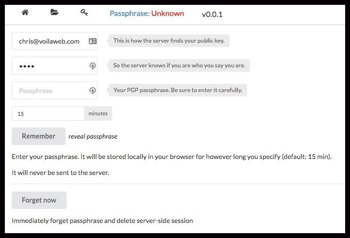
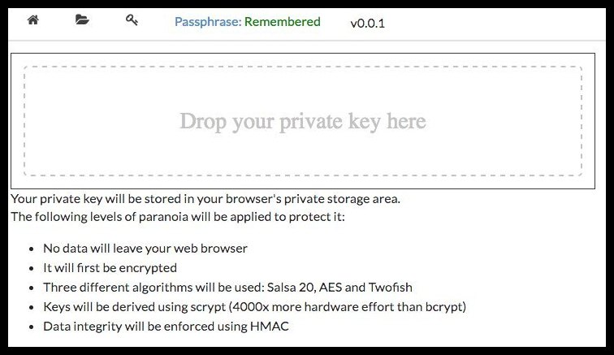
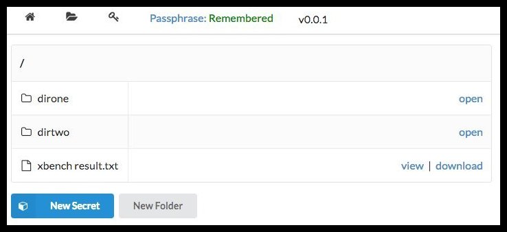

# crystalvault

## TOC:

* Rationale and Security
* Manual Setup (option #1)
* Docker Setup (option #2)
* Usage
* Contributing

## Rationale and Security

Please read (preferably in a browser): 
[Goals, Security, FAQ](public/content/design_content.txt)

## Manual Setup (option #1)

* On a fresh Linux install, e.g. Ubuntu 14.04
* **Optional:** Install Dropbox
* Install Crystal
* Alternatively you could build on a dev machine and install on prod environment
 but this is not covered in this file
* Pick a work directory (work-directory)
* Clone git environment in work-directory: `git clone https://github.com/Fusion/crystalvault.git`
* Create directory structure: `work-directory/{data/auth, data/keys/, data/logs}` 
* **Optional:** Create a symbolink link from the Dropbox folder to `work-directory/data/data`
* Alternatively create `work-directory/data/data` -- ensure it is writable
* Run server -- now accessible at `http://your-server:3000` or through a load balancer
* Ready

## Docker Setup (option #2)

Note that, for backup and file history reasons,
 the docker version of this vault insists on storing its data on Dropbox.
 Keep in mind that it is encrypted data so you are getting the best of both worlds.

In an enterprise environment, you may be behind a firewall.
In that case, provide at least a `HTTPS_PROXY` environment variable.

Port 3000 is exposed, as well as the /dbox/Dropbox folder.

To complete linking to Dropbox, check the content of /var/log/dropbox. For instance:

    docker run -d —restart=always —name tvault cyansmoker/crystalvault
    docker exec -it tvault tail -f /var/log/dropbox

After a while, you should see this line:

> Please visit https://www.dropbox.com/cli_link_nonce?nonce=<nonce> to link this device.

Follow that link, authorize the container and after a few seconds Dropbox should start synchronizing.

Note that the container will wait for Dropbox to be properly mounted before starting the vault itself.

You will then be able to browse the vault at http://container-ip:3000 (or whatever load balancer you are using, if any)

## Usage

* Users will be identified using their chosen email address.
* Each user's public PGP key must be stored on the server. Specifically, in:
 `work-directory/data/keys/user-s-email-address`
* Additionally, each user needs to pick a password. The sole purpose of that password
 is to force users to authenticate before they are allowed to delete files(!)

    Instruct new users to visit `http://your-server:3000/newuser.json/user-s-email-address/user-s-password`
 and send the resulting output to you. You know what to do next!

* Whenever a user visits `http://your-server:3000` they should click on 'Passphrase'
 and enter: `user-s-email-address`, `user-s-password` and their secret PGP pass phrase.

    Please visit [Goals, Security, FAQ](public/content/design_content.txt) to learn more about
 the security measures taken to protect the pass phrase.

* If they have not done so yet, they should then click the key icon and drag/drop
 a file containing their private PGP key.

    This key will be securely encrypted and
 never leave their browser. Again, have a look at 
 [Goals, Security, FAQ](public/content/design_content.txt) for more information.

* They can now click the folder icon and start creating new secrets and retrieving
 the secrets they are allowed to read.

## Contributing

1. Fork it ( https://github.com/Fusion/crystalvault.git )
2. Create your feature branch (git checkout -b my-new-feature)
3. Commit your changes (git commit -am 'Add some feature')
4. Push to the branch (git push origin my-new-feature)
5. Create a new Pull Request

## Contributors

- [fusion](https://github.com/fusion) Chris F Ravenscroft - creator, maintainer
